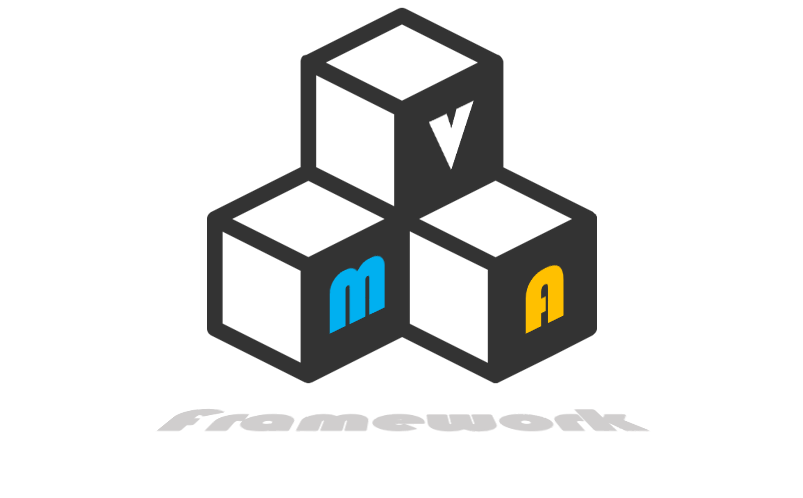

# README #

Please read this document before getting too far with the framework. There is robust documentation on VI block diagrams, so please browse and read the source to understand how (and why) it works.

### This repo holds an open-source extension to the LabVIEW Actor Framework and includes the following features:###

* Separation of Concerns design pattern (Model-View-ViewModel, in the author's opinion --  See https://msdn.microsoft.com/en-us/library/hh848246.aspx)
* Mediated data bus with implicit type safety (Subscribers request data by type--any type)
* Abstractions for launching and managing dynamic (i.e. nested) viewable actor UIs
* Viewable Actor event-routing policy that allows dynamic views to work without insane coupling
* Multiple publication/binding types for publishing mediated data into viewable (and other) Actors
* Transport abstraction to allow painless interaction with non-Actor actors (i.e. actors that are not built on the LabVIEW Actor Framework)
* Policy-based subscriptions to decouple behavior of publishers and subscribers ("I want 'x' data of type DBL with these conditions..." --> details abstracted from Publisher and Mediator)

### How do I get set up? ###

* You may use this framework in one of (at least) two ways...
* OPTION 1: Install the dependencies, and then use the framework source code as the starting point for a project (like a template)
* OPTION 2: Install the dependencies AND the MVA Framework package and use the framework like a built-in extenstion to the NI Actor Framework (like a proper framework library--the preferred way)
* OPTION 1 means you're on your own with bug fixes and updates; OPTION 2 means you can download and update VI Package to apply fixes and updates (again, this is a better way) 
* All tests are written for JKI's VI Tester -- you will need to install VI Tester through VI Package Manager to run tests. If you are not changing the framework, there's no need to run tests.
* See below for source code Dependencies

### DEPENDENCIES ###

* All dependencies are included in this repo as VI Packages in a folder aptly named "Dependencies". Install them through VI Package Manager.
* Source code for dependencies is also open-sourced and located in the public project "Composed Systems Libraries"
* You DO NOT need to pull the source code of the dependencies to use or edit the framework--just install and use the packages.

### Contribution guidelines ###

* Tests: Reasonable rigor must be applied to framework testing. Some of those tests might wander into the strange territory of performance testing/benchmarking, but do so out of necessity. Verifying functionality of units (transports, policies, etc.) is not enough. We must have confidence the framework can handle--for example--transmitting 1000 messages in less than x milliseconds.
* Code review: For now, contributions must be reviewed by the repo owner before rolling into the main branch. Please contact me if you want to contribute.
* All code in this repo must be compliant with the SOLID design principles.

### Who do I talk to? ###

* Ethan Stern | Composed Systems, LLC
* ethan.stern@composed.io